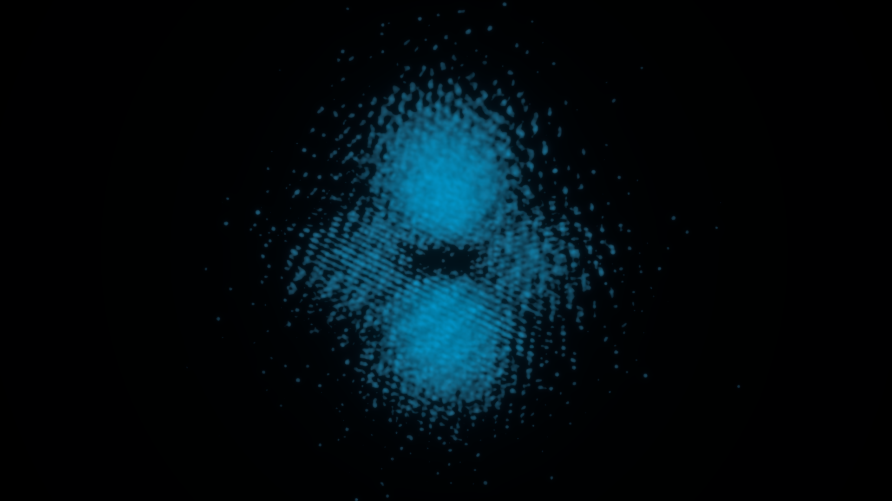
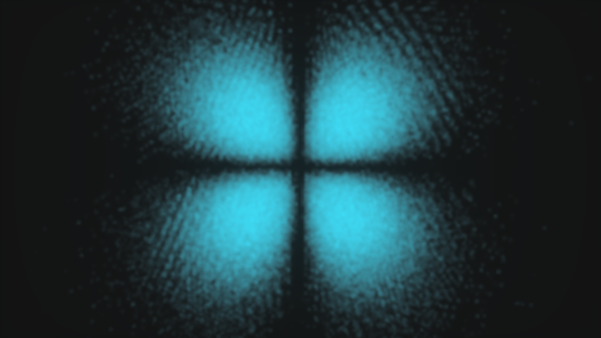

# Quantum Orbital Visualizer: From C to Blender

This project is a physics and 3D design study that simulates hydrogen atom orbitals (such as $3d_{xy}$, $3d_{z^2}$) using the Monte Carlo method, and visualizes the resulting spatial data as photorealistic, volumetric clouds in Blender.

## 🧠 How Does Our C Code Work? (Monte Carlo Simulation)

In quantum mechanics, we cannot pinpoint an electron's exact location; we can only calculate the *probability* of finding it in a specific region (Born Interpretation). Our C code takes this complex mathematics and converts it into 3D visual data:

1. **Random Coordinate Generation:** A random $(x, y, z)$ point is selected within a bounded 3D space (e.g., between -30.0 and 30.0).
2. **Wave Function (Schrödinger):** The value of the quantum wave function ($\psi$) at that specific coordinate is calculated, and its square is taken to determine the "probability density."
3. **Rejection Sampling (Rolling the Dice):** A random test value between 0.0 and 1.0 is generated.
4. **Filtering:** If the generated test value is *less* than the probability density at that point, the coordinate is accepted and saved as a valid electron position. If it is greater, the point is rejected.
5. **Data Output:** This loop runs continuously until exactly 1,000,000 (one million) valid coordinates are collected. The approved points are then exported into a massive `.csv` file for Blender to process.

## 🚀 How to Run

### 1. Compiling and Running the C Code (Linux)
Open your terminal and compile the code using the standard C compiler (GCC). The `-O3` flag ensures maximum CPU optimization, allowing 1 million points to be calculated in mere seconds:

```bash```  
```gcc simulasyon.c -o simulasyon -lm -O3 ```

Next, execute the simulation:

``` bash ``` 
``` ./simulasyon```   


This process will generate a .csv file containing the point cloud data in your current directory.


2. Blender Import and Volumetric Rendering

    Open Blender and navigate to the Scripting workspace.

    Run the provided blender_import.py script to import the CSV data into your scene as a point cloud (vertices).

    Using Geometry Nodes, apply a Points to Volume node to convert the discrete points into a continuous, smooth mist.

    In the Shader Editor, configure the quantum glow (neon blue emission) using a Principled Volume shader. A ColorRamp mask is highly recommended to prevent the dense core from overexposing (blowing out) the render.

    Render the final image using the Cycles (CPU) engine, utilizing OpenImageDenoise for a clean, noise-free result.

🌌 Results (Blender Cycles Renders)
Below are the high-fidelity orbital outputs achieved through this mathematical simulation and volumetric render pipeline:  

$3d_{z^2}$ Orbital(Dumbbell and Torus Ring) 


$3d_{xy}$ Orbital(Four-Leaf Clover Structure)



